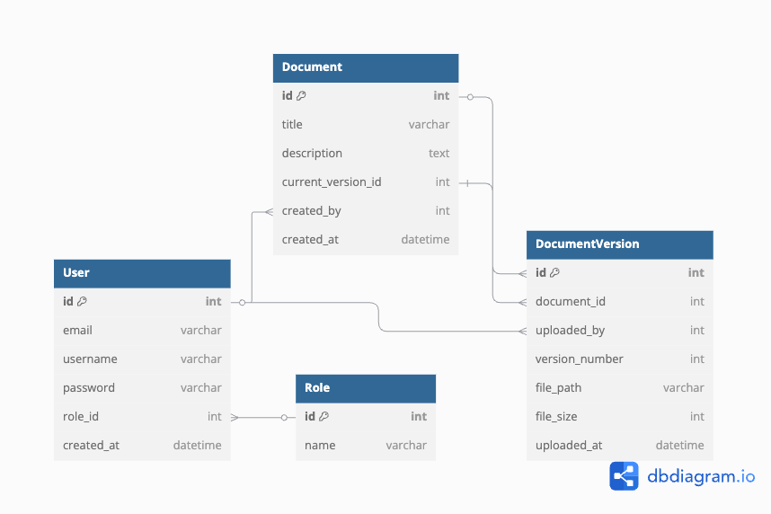

# 도메인 및 ERD 설계

Date: 2025-04-24

## 상태

적용 중

## 맥락

miniDMS 프로젝트는 웹 상에서 문서를 업로드하고 다운로드하며, 각 문서에 대한 버전 관리 및 복원 기능을 제공하는 경량형 문서 관리 시스템이다.  
도메인 및 데이터 구조는 이러한 서비스 흐름을 효과적으로 표현하고 처리할 수 있도록 설계되어야 하며, 이후 JPA 엔티티 클래스 설계 및 DB 연동을 위한 기반이 된다.  
현재 시스템은 Spring Web MVC + JSP + jQuery 기반으로 작동하며, 서버는 라즈베리파이 환경에서 동작하므로 단순하고 명확한 데이터 모델이 요구된다.

## 결정

아래와 같이 4개의 핵심 도메인을 정의하고, 그 관계를 기반으로 ERD를 설계하였다.

### 관계 요약

- User 1 ─── N Document
- User 1 ─── N DocumentVersion
- Document 1 ─── N DocumentVersion
- Document 1 ─── 1 DocumentVersion (currentVersionId)
- User.role은 Role 테이블의 외래키로 연결

 
+ DocumentVersion에 file_name 추가 (UUID로 변환된 실제 저장 파일명)

## 결과
- 시스템의 흐름에 맞는 명확하고 단순한 도메인 모델 구조가 수립되었음

- 도메인 간 관계 정의가 명확하여 이후 JPA 매핑 설계 및 Service 레이어 구성에 용이함

- ERD 스크립트를 통해 실제 DB 설계 및 생성에도 바로 활용 가능

- 문서의 버전 관리와 사용자 권한 구조가 데이터 모델에 반영되었음